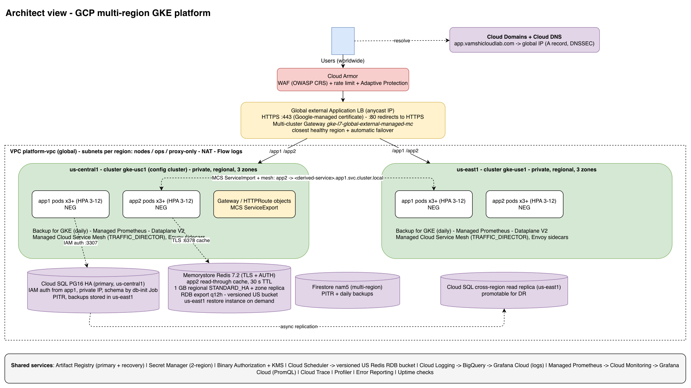
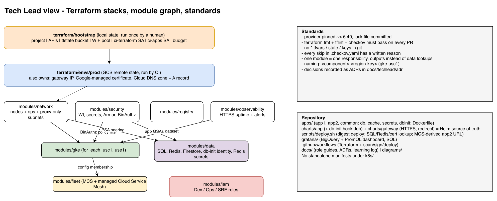
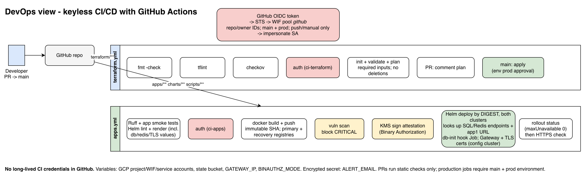
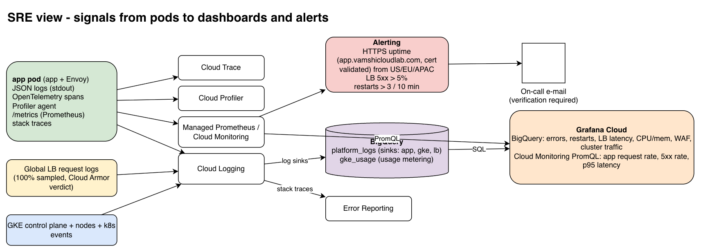
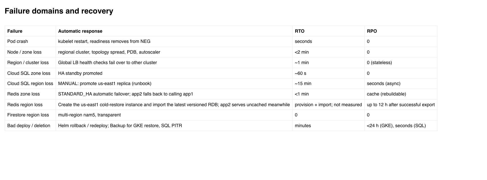
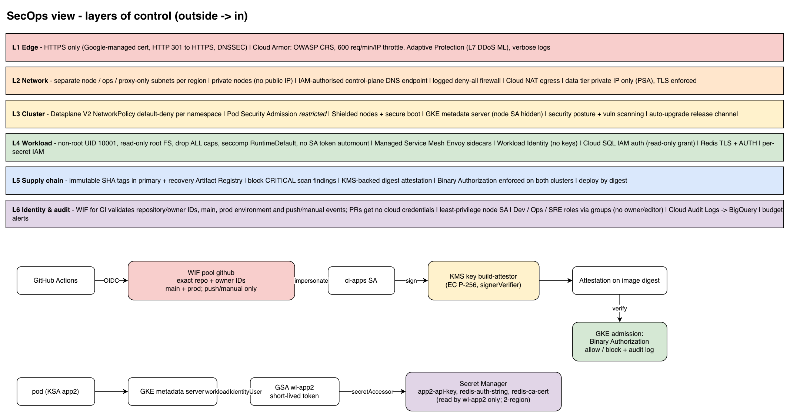

# GCP Multi-Region GKE Platform (Terraform + Helm)

A production-style platform on Google Cloud, built entirely as code. It runs two web apps in **two US regions at the same time** behind one HTTPS address. If a region fails, traffic moves to the other region automatically.

**Live address:** https://app.vamshicloudlab.com (`/app1/...`, `/app2/...`)

> This README mirrors the Confluence page "GCP Multi-Region GKE Platform: Architecture, Decisions & Operations". Keep the two in step.

## Contents
1. [Overview in plain English](#1-overview-in-plain-english)
2. [Architecture diagrams](#2-architecture-diagrams)
3. [How a request is handled](#3-how-a-request-is-handled)
4. [Step-by-step implementation](#4-step-by-step-implementation)
5. [Folder structure](#5-folder-structure)
6. [What the code does](#6-what-the-code-does)
7. [Automation pipelines](#7-automation-pipelines)
8. [Security design](#8-security-design)
9. [Monitoring and observability](#9-monitoring-and-observability)
10. [Failures, recovery and runbooks](#10-failures-recovery-and-runbooks)
11. [Decision register](#11-decision-register)
12. [Open items and known limits](#12-open-items-and-known-limits)
13. [Cost](#13-cost-rough-not-a-quote)
14. [Glossary](#14-glossary)
15. [Documentation map](#15-documentation-map)

## 1. Overview in plain English
Think of a restaurant chain with two identical branches (Iowa and South Carolina). A smart receptionist (the load balancer) sends each guest to the nearest open branch, a security guard (Cloud Armor) checks guests at the door, and if one branch closes the guests simply go to the other. The recipes (application code) and building plans (Terraform) are written down, so a new branch can be built the same way. Every change passes automatic quality, security and safety checks before it reaches production.

### What is live today
| Area | State |
|---|---|
| Google Cloud project | `gke-mc-platform-100324148` (single production project) |
| Regions | `us-central1` (cluster `gke-usc1`, also the config cluster) and `us-east1` (cluster `gke-use1`) |
| Applications | **app1** (catalog) and **app2** (orders); 3 pods each per region, scaling to 12 |
| Public address | **https://app.vamshicloudlab.com** (one global IP `34.111.154.24`); HTTP redirects to HTTPS |
| Domain and certificate | `vamshicloudlab.com` registered in Cloud Domains, served from Cloud DNS (DNSSEC on); Google-managed TLS certificate |
| Data | Cloud SQL PostgreSQL 16 (HA + cross-region replica) read by app1; Redis 7.2 (1 GB, TLS) used by app2; Firestore (`nam5`) for counters |
| Network layout | Per region: node subnet, ops/monitoring subnet, proxy-only (load balancer) subnet |
| Team access | Developer (read-only), Operator and SRE role sets bound to the project owner; Terraform never grants owner or editor |
| Monitoring | Grafana Cloud dashboards, Cloud Monitoring alerts (email), logs in BigQuery, Cloud Trace, Profiler, Error Reporting |
| Safety checks | Tests, Helm/Terraform lint, security scan, vulnerability gate, signed images, Binary Authorization enforced |

### Who should read what
| If you are... | Start here |
|---|---|
| Leadership / non-technical | Sections 1, 2, 11, 13 |
| Project / product manager | Sections 1, 2, 3, 10, 12 |
| Developer | Sections 3, 4, 5, 6, 7 |
| DevOps / platform engineer | Sections 4, 5, 6, 7 |
| Security | Sections 2.6, 8, 11 |
| On-call / SRE | Sections 2.4, 2.5, 9, 10 |

## 2. Architecture diagrams
Editable sources (draw.io) are in [diagrams/](diagrams/); the images below are rendered from them.

### 2.1 System overview


Follow the arrows from the top. Visitors look up `app.vamshicloudlab.com` in Cloud DNS, pass Cloud Armor, reach the global load balancer (HTTPS with a managed certificate) and are sent to one of two regions (green). Each region runs the same apps. Purple shapes are data stores. Dashed lines show app1 using Cloud SQL, app2 using Redis, and the main database copying to its standby in the second region. The grey bar lists shared services.

### 2.2 Code structure and Terraform modules


The orange box is the one-time bootstrap. The blue box is the production environment, which assembles modules: network, security, registry, observability, gke (built once per region), data, fleet and iam. Arrows mean one block must exist before the next.

### 2.3 Delivery pipelines


Top lane: infrastructure pipeline (checks, plan, apply). Bottom lane: application pipeline (tests, build, scan, sign, deploy). Red boxes are where the pipeline proves its identity with a short-lived token; no long-lived keys are stored.

### 2.4 Observability


An app pod emits logs, traces, profiles and metrics. They flow through Cloud Logging and Managed Prometheus into BigQuery or Cloud Monitoring and are shown in Grafana. The Alerting box watches HTTPS uptime, errors and restarts and emails the on-call person.

### 2.5 Failure and recovery


Each row is something that can go wrong, what happens automatically, how long recovery takes (RTO) and how much recent data could be lost (RPO). Rows marked MANUAL need the runbooks in section 10.

### 2.6 Security in layers


Six bands from the outside (L1 edge) to the inside (L6 identity and audit). The lower half shows how CI proves who it is and signs images, and how a pod gets short-lived access to only its own secrets.

## 3. How a request is handled
1. **The visitor** opens `https://app.vamshicloudlab.com`. Cloud DNS returns the single global IP and Google routes the request into its network at the nearest edge.
2. **TLS** ends at the edge with a Google-managed certificate. Plain HTTP only receives a redirect to HTTPS.
3. **Cloud Armor** checks for common attacks and applies a per-visitor rate limit.
4. **The global load balancer** picks the closest healthy region; failed regions are skipped.
5. **The Gateway** routes `/app1` to app1 and `/app2` to app2.
6. **A pod** answers. Pods are spread over three zones.
7. **Data access:** app1 reads its catalog from Cloud SQL using its Google identity (no password). app2 looks in Redis first (30-second cache); on a miss it calls app1 and stores the answer.
8. **app2 calling app1** uses the internal name from the ServiceImport annotation `net.gke.io/derived-service` (`http://<derived>.app1.svc.cluster.local:8080/app1/items`).
9. **The response** returns along the same path; logs, traces and metrics are recorded at every hop.

## 4. Step-by-step implementation
The order in which the platform was built. Commands use project `gke-mc-platform-100324148`.

**Step 0. Workstation.** Install Google Cloud CLI (+ `gke-gcloud-auth-plugin`), Terraform 1.16.5, `kubectl`, Helm 4, Docker, Python 3.12, `tflint`, `checkov`. Sign in twice: `gcloud auth login` and `gcloud auth application-default login` (gcloud and Terraform read different credentials).

**Step 1. Bootstrap (once).** `terraform/bootstrap` creates the project, billing link, APIs, state bucket, keyless CI trust, two CI identities and a budget alert.
```bash
cd terraform/bootstrap
cp terraform.tfvars.example terraform.tfvars   # project_id, billing_account
terraform init && terraform plan -out tfplan && terraform apply tfplan
terraform output -raw gh_variable_commands      # prints the CI settings
```

**Step 2. Point tools at the project.**
```bash
export PROJECT_ID=$(terraform output -raw project_id)
gcloud config set project "$PROJECT_ID"
gcloud auth application-default set-quota-project "$PROJECT_ID"
```

**Step 3. Build the platform.** `terraform/envs/prod` creates, in dependency order: network (VPC, node/ops/proxy-only subnets, NAT, firewall), security (service accounts, secrets, signing key, Cloud Armor, Binary Authorization), registry, two GKE clusters, fleet (multi-cluster services and service mesh), data (Cloud SQL, Redis, Firestore, backups), observability, IAM roles, the global gateway IP, the managed TLS certificate and the Cloud DNS zone.
```bash
cd terraform/envs/prod
cp terraform.tfvars.example terraform.tfvars    # project_id, ci_apps_sa
terraform init -backend-config="bucket=${PROJECT_ID}-tfstate"
terraform plan -out tfplan && terraform apply tfplan    # ~20-25 minutes
```
Check: two clusters `RUNNING`, Fleet memberships healthy, a second `terraform plan` shows no changes.

**Step 4. Build and publish images.** One Dockerfile builds either app. Images go to the primary registry and a recovery registry in the other region. On Apple Silicon use `--platform linux/amd64`.
```bash
gcloud auth configure-docker us-docker.pkg.dev
REG=us-docker.pkg.dev/$PROJECT_ID/apps
for app in app1 app2; do
  docker build --platform linux/amd64 --build-arg APP=$app -t $REG/$app:manual-1 apps/
  docker push $REG/$app:manual-1
done
```

**Step 5. Deploy to both clusters.** `scripts/deploy.sh` resolves image digests, reads the app1 imported-service name, looks up the Cloud SQL connection name, Redis host and TLS certificate names, and runs `helm upgrade --install` (app1 also runs the schema job). On the config cluster it installs the gateway chart.
```bash
bash scripts/deploy.sh "$PROJECT_ID" manual-1
HOST=$(terraform -chdir=terraform/envs/prod output -raw gateway_hostname)
curl https://$HOST/app1/items      # items_source: cloudsql
curl https://$HOST/app2/orders     # cache: miss, then hit
```

**Step 6. Safety enforcement.** Binary Authorization starts in audit mode; once CI signs images set `binauthz_enforcement_mode = "ENFORCED_BLOCK_AND_AUDIT_LOG"` and apply (current production setting).

**Step 7. Monitoring and alerts.** Set `uptime_host` (any non-empty value; the checks probe the HTTPS hostname) and `alert_email`, apply, then click Google's verification email. In Grafana Cloud add the BigQuery and Cloud Monitoring data sources (a key that can only impersonate the read-only `grafana-reader`) and import `grafana/dashboards/platform-overview.json`.

**Step 8. Automatic delivery.** Set the CI repository variables (project, workload identity provider, service accounts, state bucket, gateway IP) and the encrypted `ALERT_EMAIL` secret; create the protected `prod` environment. Merges to `main` then run the pipelines in section 7.

**Step 9. Disaster-recovery extras.** Cloud SQL has a standby in the second region (manual promotion). Redis is exported every 12 hours to a versioned bucket; a replacement in the other region is created only when needed.

**Step 10. Domain, DNS and HTTPS.**
1. Terraform creates the Cloud DNS zone for `vamshicloudlab.com` (DNSSEC on) and an A record `app.vamshicloudlab.com` -> global IP.
2. Register the domain against that zone (one-time purchase, about 12 USD per year):
   ```bash
   gcloud domains registrations register vamshicloudlab.com \
     --cloud-dns-zone=platform-public --contact-data-from-file=registrant.yaml \
     --contact-privacy=redacted-contact-data --yearly-price="12.00 USD"
   ```
3. Terraform creates a Google-managed certificate; the gateway has an HTTPS listener (443) using it and an HTTP listener (80) that only redirects.
4. `deploy.sh` attaches the certificate. It turns ACTIVE minutes to an hour after DNS resolves (`gcloud compute ssl-certificates list`).
5. Click the ICANN verification email, or the domain can be suspended.

Changing the hostname later: apply, run `deploy.sh` (attaches old and new certificates together), wait for ACTIVE, deploy again, then apply once more so Terraform can delete the old certificate.

**Step 11. Team access.** `team_members` in `terraform/envs/prod/variables.tf` lists members per team (`user:`, `group:` or `serviceAccount:` prefixed; prefer Google Groups). Defaults live in `variables.tf` because CI plans without tfvars. Currently `user:vamshikh@gmail.com` holds all three role sets.

**Step 12. Tear down.**
```bash
cd terraform/envs/prod && terraform destroy       # needs deletion_protection=false
cd ../../bootstrap && terraform apply -var project_deletion_policy=DELETE && terraform destroy
```

## 5. Folder structure
```text
gcp-gke-multicluster-platform/
├── README.md                     # this file
├── .checkov.yaml                 # security-scan exceptions (each has a reason)
├── .tflint.hcl                   # Terraform lint rules
├── .github/
│   ├── workflows/
│   │   ├── terraform.yml         # infrastructure pipeline (checks, plan, apply)
│   │   └── apps.yml              # app pipeline (test, build, scan, sign, deploy)
│   └── ISSUE_TEMPLATE/           # template for logging problems we hit
├── terraform/
│   ├── bootstrap/                # run once by a person: project, APIs, state bucket, CI identity
│   ├── envs/prod/                # production environment wiring the modules together
│   │                             # also owns: gateway IP, managed TLS certificate, Cloud DNS zone + record
│   └── modules/
│       ├── network/              # VPC; node, ops and proxy-only subnets; NAT; firewall; private-services peering
│       ├── security/             # service accounts, secrets, Cloud Armor, signing key, Binary Authorization
│       ├── registry/             # Artifact Registry (primary + recovery)
│       ├── gke/                  # one cluster + node pool + backup plan (once per region)
│       ├── fleet/                # multi-cluster services and managed service mesh
│       ├── data/                 # Cloud SQL, Redis (+ DR export, secrets), Firestore, db-init identity
│       ├── observability/        # log sinks, BigQuery, HTTPS uptime checks, alerts, Grafana identities
│       └── iam/                  # Developer / Operator / SRE role bindings
├── charts/                       # Helm charts: the ONLY source of Kubernetes objects
│   ├── app/                      # both clusters, once per app
│   │   └── templates/            # namespace, deployment, service, hpa, pdb, networkpolicy,
│   │                             # serviceaccount, serviceexport, podmonitoring, db-init (hook Job)
│   └── gateway/                  # config cluster only
│       └── templates/            # namespace, gateway (HTTPS + HTTP), routes, redirect, policies
├── apps/
│   ├── Dockerfile  requirements.txt
│   ├── app1/main.py              # catalog service (Cloud SQL + Firestore)
│   ├── app2/main.py              # orders service (calls app1, caches in Redis)
│   └── common/                   # observability.py, db.py, cache.py, secrets.py, dbinit.py
├── scripts/deploy.sh             # deploys both apps to both clusters, gateway to config cluster
├── grafana/                      # dashboard JSON, BigQuery SQL, schema notes
├── docs/                         # one guide per role, ADRs, learning log
└── diagrams/                     # five draw.io sources + rendered images/
```

| Folder / file | Purpose |
|---|---|
| `terraform/bootstrap` | One-time foundation: project, APIs, state bucket, keyless CI trust, budget |
| `terraform/envs/prod` | Assembles modules into the live environment; variables and outputs |
| `terraform/modules/*` | Reusable infrastructure pieces, one responsibility each |
| `charts/app` | Everything Kubernetes needs to run one app copy (shared by app1 and app2 via values) |
| `charts/gateway` | Public entry: Gateway, HTTP routes, redirect, health-check and WAF policies |
| `apps/*` | Application code and container build |
| `scripts/deploy.sh` | Deployment logic used by CI and humans |
| `grafana/*` | Dashboard definition and the SQL behind it |

## 6. What the code does
### Terraform modules
| Module | Creates | Notable detail |
|---|---|---|
| `network` | Custom VPC; per region a node subnet (pod and service ranges), ops/monitoring subnet and proxy-only subnet; Cloud NAT; logged firewall rules; private-services peering | Default-deny ingress; allowed: LB health-check ranges, IAP, internal traffic, proxy-only to port 8080 |
| `security` | Service account per app, Secret Manager secrets, Cloud Armor, KMS signing key, Binary Authorization | Policy exists before clusters |
| `registry` | Artifact Registry (US multi-region) + recovery repository in us-east1 | Immutable tags; keeps newest 15 versions |
| `gke` | Private regional cluster, node pool (Spot in this demo), Backup for GKE plan | Called twice with `for_each` |
| `fleet` | Fleet registration, multi-cluster services, managed Cloud Service Mesh | Mesh mode `TRAFFIC_DIRECTOR` |
| `data` | Cloud SQL (HA + replica), Redis (TLS + AUTH), Firestore + backup, DB admin secret, Redis auth/CA secrets, Redis DR bucket + Scheduler export, `wl-db-init` identity | `enable_redis_dr_instance` stays false until recovery; only app2 reads the Redis secrets |
| `observability` | Log sinks to BigQuery, usage dataset, HTTPS uptime checks, 4 alert policies, email channel, Grafana identities | Alert email must be verified once |
| `iam` | Project role bindings for Developer, Operator, SRE | Roles deduplicated per member; use groups |

### Helm charts
| Template | Creates |
|---|---|
| `namespace.yaml` | Namespace with mesh injection and restricted pod-security labels |
| `deployment.yaml` | 3 replicas, rolling update with zero unavailable, probes, 10 s pre-stop drain, non-root, read-only filesystem |
| `service.yaml` / `serviceexport.yaml` | Internal service with container-native LB; publish to the other cluster |
| `hpa.yaml` / `pdb.yaml` | Autoscale 3-12; at most one pod disrupted at a time |
| `networkpolicy.yaml` | Default deny plus explicit allows |
| `serviceaccount.yaml` | KSA linked to the Google service account (keyless) |
| `podmonitoring.yaml` | Metric scraping for Managed Prometheus |
| `db-init.yaml` (app1) | `db-init` account and a post-install/upgrade Job: creates schema `catalog` and table, grants read to app1; runs without a mesh sidecar |
| gateway: `gateway.yaml`, `routes.yaml`, `redirect.yaml`, `policies.yaml` | HTTPS + HTTP listeners, path routes, 301 redirect, health checks, Cloud Armor attachment |

`values.yaml` holds per-app differences (name, project, image digest, replicas, app1 URL for app2, db and redis settings). The deployment refuses to render without an image, and without the app1 URL for app2.

### Applications
- `apps/app1/main.py`, `apps/app2/main.py`: small Flask services with health endpoints and JSON logs.
- **app1** reads its catalog from Cloud SQL (private IP, IAM database login) and keeps a hit counter in Firestore; if the database is unreachable it serves a fixed list and reports `items_source: fallback`.
- **app2** caches the app1 catalog in Redis for 30 s over TLS with a password from Secret Manager; the response shows `cache: hit | miss | unavailable`, and a Redis outage never causes an error.
- `apps/common/`: `observability.py` (logs, OpenTelemetry traces at 20 % sampling, Profiler, Error Reporting), `db.py`, `cache.py`, `secrets.py`, `dbinit.py`.
- `apps/Dockerfile`: multi-stage, non-root UID 10001; one build argument selects app1 or app2.

### Deployment script
1. Look up shared values once: Cloud SQL connection name, Redis host/port, TLS certificate names.
2. Per cluster, fetch credentials through the IAM-protected DNS endpoint.
3. Per app, resolve the image digest; for app2, read the app1 imported-service name.
4. `helm upgrade --install --wait` per app; then the gateway chart on the config cluster with all certificates attached.
5. Wait for rollouts; print the gateway IP and HTTPS hostnames.

## 7. Automation pipelines
**Infrastructure (`terraform.yml`):** format check, TFLint, Checkov on every PR; validate and plan (required inputs present, no deletions allowed); PRs get static checks only; on `main` the saved plan is applied after `prod` environment approval.

**Applications (`apps.yml`):** lint and smoke tests, Helm lint/render (including db, redis and TLS values); keyless authentication; build and push immutable images to primary and recovery registries; fail on CRITICAL vulnerabilities; sign each digest with KMS; deploy with `scripts/deploy.sh`.

Cloud credentials are only issued to jobs on `main` in the `prod` environment, because token claims are checked against the exact repository and owner identifiers.

## 8. Security design
| Layer | Controls |
|---|---|
| L1 Edge | HTTPS only (managed certificate, HTTP redirected, DNSSEC); Cloud Armor OWASP rules, 600 req/min per IP, Adaptive Protection |
| L2 Network | Separate node/ops/proxy-only subnets; private nodes; IAM-authorised control-plane endpoint; logged deny-all firewall; NAT egress; databases on private IP with TLS |
| L3 Cluster | Dataplane V2 default-deny network policy, restricted Pod Security, shielded nodes, metadata server |
| L4 Workload | Non-root, read-only filesystem, drop all capabilities, Workload Identity, per-secret IAM, mesh sidecar, Cloud SQL IAM login with read-only grant, Redis TLS + password |
| L5 Supply chain | Immutable images, vulnerability gate, KMS attestation, Binary Authorization enforced, deploy by digest |
| L6 Identity and audit | Keyless CI trust pinned to repo and owner; least-privilege node identity; Developer/Operator/SRE roles; audit logs to BigQuery; budget alerts |

**Team roles (`modules/iam`)**
| Team | Roles |
|---|---|
| Developer (read-only) | `container.viewer`, `logging.viewer`, `monitoring.viewer`, `cloudtrace.user`, `errorreporting.viewer`, `cloudprofiler.user`, `artifactregistry.reader` |
| Operator | `container.developer`, `artifactregistry.writer`, `compute.networkViewer`, `cloudsql.viewer`, `redis.viewer`, `logging.viewer`, `monitoring.viewer`, `iap.tunnelResourceAccessor` |
| SRE | `container.viewer`, `monitoring.editor`, `logging.viewer`, `cloudtrace.user`, `errorreporting.admin`, `cloudprofiler.user`, `cloudsql.viewer`, `redis.viewer`, `bigquery.dataViewer`, `bigquery.jobUser` |

**Accepted risks:** the Terraform CI identity is broad because it builds everything (reduced by main-only apply and environment approval); Grafana Cloud needs a service-account key (it can only impersonate a read-only identity); the control-plane DNS endpoint is public but IAM-protected; Google-managed (not customer-managed) encryption keys; the domain is one account-level asset (lock, WHOIS privacy and auto-renew are on).

## 9. Monitoring and observability
| Signal | Collected by | Where |
|---|---|---|
| Logs | Cloud Logging (stdout, GKE, load balancer) | BigQuery `platform_logs`, Grafana |
| Metrics | Managed Prometheus, GKE system metrics | Cloud Monitoring and Grafana (PromQL) |
| Traces | OpenTelemetry, 20 % sampling | Cloud Trace |
| Profiles | Cloud Profiler | Cloud Profiler |
| Errors | Stack traces in ERROR logs | Error Reporting |
| Synthetic | HTTPS uptime checks from US, Europe, Asia-Pacific (certificate validated) | Alerts |

Alerts: uptime failing for app1, uptime failing for app2, pods crash-looping, load-balancer 5xx above 5 %. Targets (design goals): 99.9 % availability, p95 latency under 300 ms, 99.9 % uptime over 30 days.

## 10. Failures, recovery and runbooks
| Failure | What happens | Recovery | Data loss |
|---|---|---|---|
| Pod crash | Restarted; removed from load balancing until ready | Seconds | None |
| Node or zone loss | Regional cluster, spread pods, autoscaler | < 2 min | None |
| Region or cluster loss | Load balancer shifts all traffic to the other region | ~1 min | None (stateless) |
| Cloud SQL zone loss | Standby promoted automatically | ~60 s | None |
| Cloud SQL region loss | MANUAL: promote the second-region replica | ~15 min | Seconds |
| Cloud SQL unreachable from app1 | app1 serves a fixed list (`items_source: fallback`) | Immediate | None |
| Redis zone loss | Automatic failover; app2 calls app1 directly meanwhile | < 1 min | Cache only |
| Redis region loss | MANUAL cold restore in the other region; app2 serves uncached | Provision + import (not measured) | Up to 12 h |
| Firestore region loss | Transparent (multi-region) | None | None |
| Certificate or DNS problem | Uptime checks alert | Minutes to an hour | None |
| Bad release | Helm rollback or revert and re-run pipeline | Minutes | None |

**Cloud SQL regional disaster**
```bash
gcloud sql instances promote-replica pg-replica-v1
SQL_INSTANCE=pg-replica-v1 bash scripts/deploy.sh <project> <tag>    # reconnect app1
```
**Redis regional disaster (cold restore)**
```bash
terraform -chdir=terraform/envs/prod plan -var="enable_redis_dr_instance=true" -out=tfplan-redis-dr
terraform -chdir=terraform/envs/prod apply tfplan-redis-dr
gcloud redis instances import gs://$PROJECT_ID-redis-dr/latest/cache.rdb cache-dr-v1 --region=us-east1
```
Then add new versions of the `redis-auth-string` and `redis-ca-cert` secrets from the new instance and redeploy app2 with `REDIS_INSTANCE=cache-dr-v1 REDIS_REGION=us-east1 bash scripts/deploy.sh <project> <tag>`.

**Bad release**
```bash
helm history app1 -n app1
helm rollback app1 <revision> -n app1     # repeat for app2 and for both clusters
```

| Backup | How | Kept |
|---|---|---|
| Kubernetes state | Backup for GKE, daily | 14 days |
| Cloud SQL | Automated backups + point-in-time recovery | 14 backups, 7 days of logs |
| Firestore | PITR + daily backups | 7 days |
| Redis | RDB export every 12 h to a versioned US multi-region bucket | Older versions 30 days |
| Images | Cleanup policy | Newest 15 versions |
| Logs in BigQuery | Partition expiry | 30 days |

## 11. Decision register
| # | Decision | Why | Trade-off |
|---|---|---|---|
| D1 | Everything as code (Terraform) | Repeatable, reviewable, auditable | State management |
| D2 | One project, one prod environment | Matches the brief | No safe place to test infrastructure |
| D3 | `us-central1` + `us-east1` | Separate failure domains, low cost, both in Firestore `nam5` | Both in one country |
| D4 | GKE Standard | Shows node pools, shielded and Spot nodes | More to operate than Autopilot |
| D5 | Private regional clusters, IAM DNS endpoint | No public node IPs; identity-based access | Needs NAT and auth plugin |
| D6 | Gateway API multi-cluster | Standard direction; one global LB | Newer, fewer examples |
| D7 | MCS + managed mesh; app2 uses the derived internal name | The mesh needs a name it can route | Slightly less obvious URL; ~6 USD per month |
| D8 | Helm is the only Kubernetes source | One definition, release history, rollback | Template learning curve |
| D9 | Keyless CI with Workload Identity Federation | No long-lived secrets | More setup |
| D10 | PRs get no cloud credentials | Fork PRs cannot be told apart by token claims | Plans run only after merge |
| D11 | Sign images, enforce Binary Authorization, deploy by digest | Tags can change, digests cannot | Pipeline must sign every image |
| D12 | Block CRITICAL vulnerabilities | Stops known-bad images early | May block on upstream issues |
| D13 | Logs to BigQuery, dashboards in Grafana, live metrics via PromQL | Brief requirement; cheap partitioned queries | ~1 min log delay |
| D14 | Grafana uses a key that impersonates a read-only identity | Grafana Cloud cannot use Workload Identity | One key to protect and rotate |
| D15 | Cloud SQL HA + manual cross-region promotion | Avoids accidental split-brain; cheaper | Manual step, ~15 min |
| D16 | Firestore `nam5` multi-region | Transparent regional resilience | Higher cost |
| D17 | Redis: regional HA + scheduled export + cold restore | Native replicas are same-region; cache is optional for app2 | Up to 12 h cache loss; untested restore time |
| D18 | Spot nodes in this demo | Lower cost | Nodes can be reclaimed |
| D19 | Cloud Armor at the edge | Blocks attacks before they reach clusters | Rule tuning |
| D20 | Terraform guards (required inputs, pipefail, no-deletion check) | An earlier masked failure could have deleted alerting | Deliberate deletions need a manual path |
| D21 | HTTPS with a Google-managed certificate; domain in Cloud Domains + Cloud DNS | Free auto-renewing certificate; name people remember | Yearly fee; certificate takes minutes to an hour; hostname change needs apply, deploy, apply |
| D22 | Separate ops and proxy-only subnets per region | Matches the brief; ready for internal load balancers | More ranges to plan |
| D23 | Developer / Operator / SRE role sets bound to members | Least privilege; groups handle joiners and leavers | Defaults in code; prefer groups |
| D24 | app1 uses Cloud SQL IAM login; Helm hook Job creates the schema with a dedicated identity | No password in the app; only the Job can read the admin password | Job runs each deploy; cross-region latency |
| D25 | app2 uses Redis as an optional 30 s read-through cache | Outage costs speed, not availability | Data up to 30 s old |

Detailed records: [docs/techlead/adr/](docs/techlead/adr/).

## 12. Open items and known limits
- **Alert email:** the channel is attached to all four policies; the recipient must click Google's verification link.
- **Domain email verification:** the registrant must click the ICANN verification email for `vamshicloudlab.com`.
- **Redis recovery drill:** the restore path is documented and exports run, but a full restore has not been timed. Redis is not live-replicated across regions.
- **app1 database latency:** the Cloud SQL primary is in us-central1, so app1 pods in us-east1 connect across regions.
- **Bootstrap state:** the bootstrap Terraform state is not in the shared state bucket; two CI roles (`cloudsql.viewer`, `redis.viewer`) were granted with gcloud and match the code.
- **Cost:** billable resources run until torn down.

## 13. Cost (rough, not a quote)
| Item | Approx. USD per month |
|---|---|
| 2 regional cluster management fees (1 covered by the free tier) | 73 |
| 4-6 small Spot nodes | 50-75 |
| Cloud SQL HA + replica | 110 |
| Redis 1 GB | 50 |
| Global load balancer + Cloud Armor | 25 |
| Logging, BigQuery, Trace (low traffic) | under 10 |
| Managed service mesh (12 minimum app clients) | about 6 |
| Domain `vamshicloudlab.com` | 12 per year |
| Cloud DNS zone | about 0.2 |

Enabling the optional second-region Redis instance adds a second always-on cache. Use Cloud Billing for real figures.

## 14. Glossary
| Term | Plain-English meaning |
|---|---|
| Region / zone | A geographic area with data centres / one data centre within it |
| Cluster (GKE) | A group of machines that runs our apps, managed by Google Kubernetes Engine |
| Pod | One running copy of an application |
| Container / image / digest | A packaged app / the frozen package / its unchangeable fingerprint |
| Load balancer | Directs visitors to healthy copies |
| Gateway API / HTTPRoute | Rules that decide which app receives which URL path |
| Failover | Automatically switching to a healthy copy |
| RTO / RPO | How long recovery takes / how much recent data may be lost |
| Terraform | Describing cloud resources in files so they can be reviewed and rebuilt |
| Helm / chart | Package manager and templates for Kubernetes objects; a Helm hook runs a step before or after a release |
| CI/CD | Automatic testing and delivery of every change |
| Workload Identity (Federation) | Letting pods (or CI) use a Google identity without stored passwords |
| Binary Authorization / attestation | A gate that only lets signed images run / the signature |
| KMS | Google service that holds the signing key |
| Cloud Armor / WAF | Web application firewall at the edge |
| Service mesh / Envoy sidecar | A helper proxy next to each app for secure service-to-service traffic |
| MCS | Lets a service in one cluster be used from another |
| HPA / PDB | Automatic scaling of pods / limit on pods taken down at once |
| Network policy | Firewall rules between pods |
| DNS / Cloud DNS / DNSSEC | The internet phone book / Google's service for it / signatures that stop forged answers |
| Cloud Domains | Google service to buy and renew the domain |
| Managed TLS certificate | Proof the site is genuine and the key to encrypt traffic; Google issues and renews it |
| IAM database authentication | Logging in to the database as a Google identity, not a password |
| Read-through cache | Look in the fast cache first; on a miss fetch and keep a copy briefly |
| Proxy-only subnet | Address range used by Google load-balancer proxies |
| PromQL / Prometheus | Query language / metrics system for live rates and latency |
| BigQuery / Grafana | Analytics database where logs are stored / dashboard tool |
| SLO / PITR / RDB | Reliability target / restore to any recent moment / Redis snapshot file |
| Cold restore | Create a replacement only when disaster happens and load a backup into it |

## 15. Documentation map
| Role | Document | Diagram source |
|---|---|---|
| Architect | [solution-design](docs/architect/solution-design.md) | [01](diagrams/01-architect-solution.drawio) |
| Tech Lead | [engineering-standards](docs/techlead/engineering-standards.md), [ADRs](docs/techlead/adr/) | [02](diagrams/02-techlead-repo-and-modules.drawio) |
| DevOps | [setup-guide](docs/devops/setup-guide.md) | [03](diagrams/03-devops-cicd.drawio) |
| SRE | [observability-and-dr](docs/sre/observability-and-dr.md) | [04](diagrams/04-sre-observability-dr.drawio) |
| SecOps | [security-design](docs/secops/security-design.md) | [05](diagrams/05-secops-security.drawio) |

BigQuery schema and Grafana queries: [grafana/bigquery-schema.md](grafana/bigquery-schema.md). Every command run is explained in [docs/learning-log.md](docs/learning-log.md); every problem is logged as a GitHub Issue labelled `issue-encountered`.
